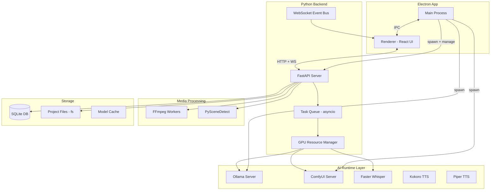
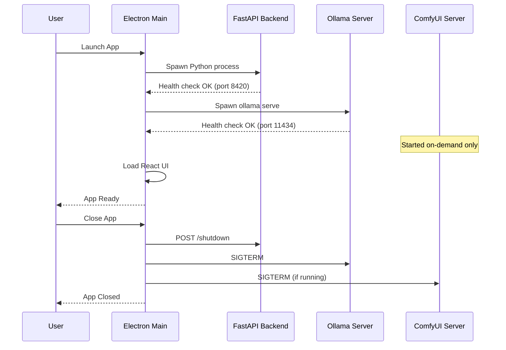
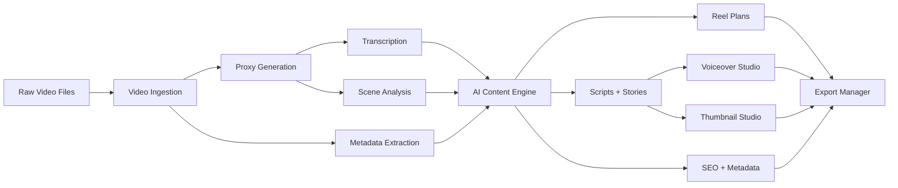
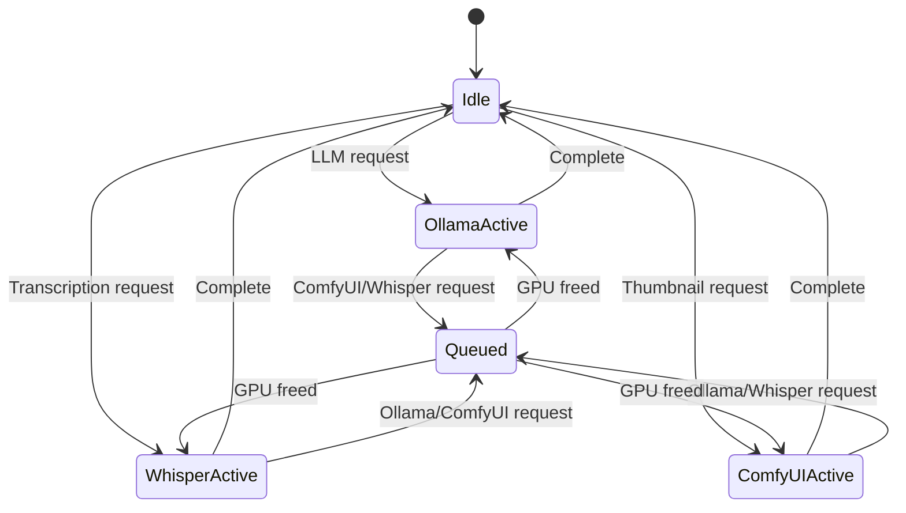
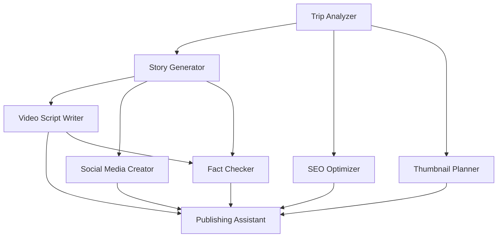
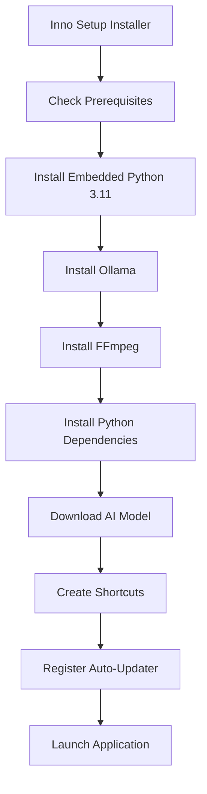

# Travel Content Studio -- Architecture Document

## 1. Overview

Travel Content Studio is a local-first, GPU-accelerated desktop application that transforms raw travel footage, transcripts, photos, itineraries, and notes into complete travel content assets using local AI.

### Supported Platforms

| Platform | GPU Acceleration | Installer |
|----------|-----------------|-----------|
| Windows 11 | NVIDIA CUDA | Inno Setup (.exe) + electron-builder NSIS |
| macOS 13+ (Apple Silicon) | Metal / MPS | DMG via electron-builder |
| macOS 13+ (Intel) | CPU only | DMG via electron-builder |

### Reference Hardware

**Windows:** HP Victus fb3130AX -- AMD Ryzen 7 7445HS, NVIDIA RTX 4050 6GB, 16GB DDR5

**macOS:** MacBook Pro -- Apple M2 Pro, 16GB unified memory

### Primary Objectives

1. Fully local operation after installation
2. One-click installer
3. GPU accelerated
4. No Docker required
5. Easy for non-technical users
6. Production quality architecture
7. Modular and extensible
8. Suitable for future commercial use

---

## 2. System Architecture

### Component Responsibilities

| Component | Technology | Role |
|-----------|-----------|------|
| Electron Main | Node.js | Process lifecycle, IPC bridge, auto-updater |
| React Renderer | React + TypeScript | UI, user interactions |
| FastAPI Backend | Python 3.11 | REST API, business logic, job orchestration |
| GPU Resource Manager | asyncio Semaphore | Serialize GPU tasks, prevent VRAM OOM |
| Task Queue | asyncio | Background job execution with progress |
| WebSocket Bus | FastAPI WebSocket | Real-time event broadcasting to UI |
| Ollama | External binary | LLM inference (qwen3 family) |
| ComfyUI | External binary | Image generation (FLUX Schnell) |
| Faster Whisper | Python library | Speech-to-text transcription |
| FFmpeg | External binary | Video processing, proxy generation |
| PySceneDetect | Python library | Scene boundary detection |
| Kokoro TTS | Python library | Text-to-speech (primary) |
| Piper TTS | External binary | Text-to-speech (fallback) |
| SQLite | Python stdlib | Metadata storage |

---

## 3. Process Lifecycle

---

## 4. Data Flow: Video to Content Pipeline

---

## 5. GPU Resource Management

Multiple GPU consumers (Ollama, Faster Whisper, ComfyUI) cannot share the GPU simultaneously. On Windows with an NVIDIA RTX 4050 (6GB VRAM), this is a hard constraint. On Apple Silicon, unified memory is shared between CPU and GPU, but serialization still prevents OOM under heavy load. The GPU Resource Manager serializes access on both platforms.

### Auto Model Selection

| System RAM | GPU | Model | Inference Mode |
|-----------|-----|-------|---------------|
| 8GB | any | qwen3:8b | CPU or partial GPU |
| 16GB | NVIDIA 6GB / Apple M1+ | qwen3:14b | CUDA offload / Metal |
| 32GB | NVIDIA 6GB / Apple M2 Pro+ | qwen3:32b | Partial GPU + CPU |

On Apple Silicon, RAM and VRAM are unified -- the model selection is based purely on total system RAM, which is the correct behavior for both platforms.

---

## 6. Module Architecture

### Modules Overview

| Module | Name | Dependencies |
|--------|------|-------------|
| 1 | Project Management | SQLite |
| 2 | Video Ingestion | FFmpeg |
| 3 | Transcription | Faster Whisper, GPU Manager |
| 4 | Scene Analysis | PySceneDetect |
| 5 | AI Content Engine | Ollama, GPU Manager |
| 6 | Insta360 Copilot | FFmpeg, Ollama |
| 7 | Travel Storyteller | Ollama |
| 8 | Reel Generator | Ollama, FFmpeg |
| 9 | YouTube Copilot | Ollama |
| 10 | Thumbnail Studio | ComfyUI, FLUX, GPU Manager |
| 11 | Voiceover Studio | Kokoro TTS, Piper |
| 12 | Blog Studio | Ollama |
| 13 | Travel Agents | Ollama, all modules |

### Agent Pipeline (Module 13)

---

## 7. Deployment Architecture

---

## 8. Security Model

- All processing happens locally; no data leaves the machine
- No telemetry by default
- No secrets in source code
- SQLite database stored in user's home directory (`~/.travel-content-studio/`)
- Secure auto-update via signed releases from GitHub
- File access scoped to project directories

---

## 9. Tech Stack Summary

| Layer | Technology |
|-------|-----------|
| Desktop Shell | Electron |
| Frontend | React, TypeScript, Zustand, TailwindCSS |
| Backend | FastAPI, Python 3.11 |
| Database | SQLite + SQLAlchemy + Alembic |
| LLM Inference | Ollama (qwen3 family) |
| Transcription | Faster Whisper |
| Scene Detection | PySceneDetect |
| Image Generation | ComfyUI + FLUX Schnell |
| TTS | Kokoro TTS (primary), Piper (fallback) |
| Video Processing | FFmpeg |
| Installer | Inno Setup (Windows), DMG (macOS) |
| Packaging | PyInstaller (backend), electron-builder (frontend) |
| Auto-Update | electron-updater |
